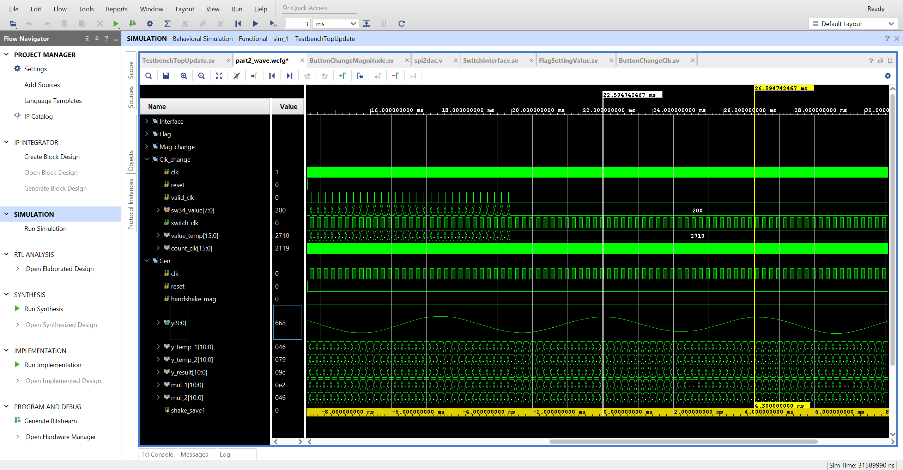

# FPGA report

## Part 1: Simple FIR Filter (RTL)

**(a) An explanation about the design approach (include the techniques used in the design with required diagrams etc) [05 marks] **

Refer to report

**(b) SystemVerilog codes for the entire design [10 marks]**

Please check the related files

Matlab: ./Coursework/Part1/task1

Vivado: ./Coursework/Part1/part1_task2_4/part1_task2_4.srcs

**(c) Test plan for individual blocks and a summary of results [05 marks] **

**(d) Plots/figures/screenshots of functional simulation in MATLAB and/or Vivado/Modelsim (demonstrate your results to a TA or the Lecturer to obtain marks for this section, otherwise this part will be marked out of 7). [15 marks] **

**(e) A discussion explaining your results [05 marks]**

Refer to report

## Part 2: Digital Sinusoidal Oscillator Design

**(a) An explanation about the design approach (include the techniques used in the design with required diagrams etc) [05 marks]**

Refer to report

**(b) SystemVerilog codes for the entire design [10 marks]**

Matlab/Python: ./Coursework/Part2

Vivado: ./Coursework/Part2/part2_task1_3/part2_task1_3.srcs

**(c) Plots/figures/screenshots of functional simulation in MATLAB and/or Vivado/Modelsim (demonstrate your results to a TA or the Lecturer to obtain marks for this section, otherwise this part will be marked out of 7) [10 marks]**

**(d) Snapshots of oscilloscope outputs of the DAC demonstrating the output signal parameters (demonstrate your results to a TA or the Lecturer to obtain marks for this section, otherwise you will receive max 10 marks for this part). [25 marks]**

Later

**(e) Extra design features introduced and results (can you change the amplitude/frequency while in operation? ).**

part2_max_freq

part2_min_freq

part2_max_mag

part2_mini_mag

